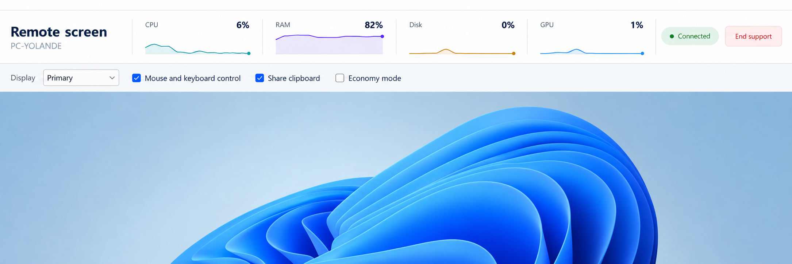

# Remote screen header redline



Approved 2026-09-23 and reaffirmed by the supplied blueprint. This image is the specification for the native Remote screen header and display toolbar. At its 1.5× reference scale, the 2170-pixel content width maps to 1447 logical pixels: header 116 high, toolbar 52 high, chart band x=241..1198 and y=35..100, selector 139×30, status pill 106×34, and End support 104×38. Match its typography, colors, dividers, fills, rounded controls, spacing and alignment. The numbers and traces are illustrative; production uses measured values on a fixed 0–100% scale and the live remote screen. Preserve the existing second chart row when the window is too narrow for the single-row composition.

## Imagegen prompt

Follow-up adjustment: add 3 logical pixels between the title and subtitle, as requested after the blueprint comparison.

```text
Use case: ui-mockup
Asset type: high-fidelity redesign mockup of the existing Remote Debugger Windows desktop application's top header and screen toolbar.
Input image: Image 1 is the current UI reference. Preserve its light theme, identity, English labels, four metric colors, connected state, and existing control choices. This is a proposed redesign, not real telemetry.
Primary request: make the CPU, RAM, Disk and GPU charts look clear, compact, intentional and professional; also vertically center the Display label, its selector, and every checkbox in the toolbar.
Composition: a single straight-on, crisp screenshot-style UI mockup, wide landscape, roughly 3:1 aspect ratio. No device frame, perspective, presentation board, captions, annotations or surrounding marketing material. The application occupies the image. Show one refined header followed by one aligned control toolbar; below them only a modest glimpse of the neutral remote-screen viewport. Keep the header compact, about 100 logical pixels tall, so the remote screen stays dominant.
Header: left section has 'Remote screen' on one line in dark navy semibold Segoe UI, with 'PC-YOLANDE' below in smaller muted gray. Middle is one horizontal row of four equal compact metric modules, separated by very subtle pale gray vertical dividers. Each module has a small muted label at top left and the current value at top right in clear semibold type. Below is a continuous, legible 1.5-pixel sparkline over a faint matching area fill, with a delicate baseline. Keep equal plot heights and generous modest padding. CPU teal, RAM violet, Disk muted amber, GPU blue. Use one consistent fixed 0–100% scale: CPU 6% line mostly low with small plausible changes, RAM 82% at the upper part with gentle variation, Disk 0% mostly on baseline with one small bump, GPU 1% near baseline with two tiny bumps. Do not magnify tiny load into dramatic mountains. Connect illustrative history continuously across each plot; no arbitrary floating line fragments. The last point has a tiny colored dot. No grid clutter, axes, legends or chart boxes. Right section has a restrained pale green 'Connected' pill with a green status dot, then a compact pale red outlined 'End support' button. All header groups centered vertically on the same band.
Toolbar: very pale cool-gray strip with a thin top divider, 52 logical pixels tall, generous 16 px left padding. Text 'Display' and dropdown showing 'Primary' share the same vertical centerline, followed by checked 'Mouse and keyboard control', checked 'Share clipboard', and unchecked 'Economy mode'. Use familiar small Windows checkboxes, restrained spacing, and vertically center the entire row.
Text verbatim: 'Remote screen', 'PC-YOLANDE', 'CPU', '6%', 'RAM', '82%', 'Disk', '0%', 'GPU', '1%', 'Connected', 'End support', 'Display', 'Primary', 'Mouse and keyboard control', 'Share clipboard', 'Economy mode'.
Style: realistic implementable native Windows productivity software, Segoe UI, white and very light neutral surfaces, dark navy text, crisp alignment, restrained 4–6 px corner radii only for button, selector and status. No extra features, no sidebar, no invented actions, no oversized card grid, no dark theme, no glossy effects.
```
